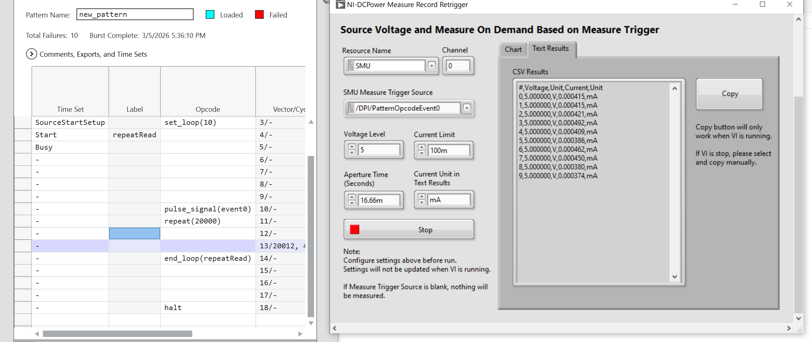
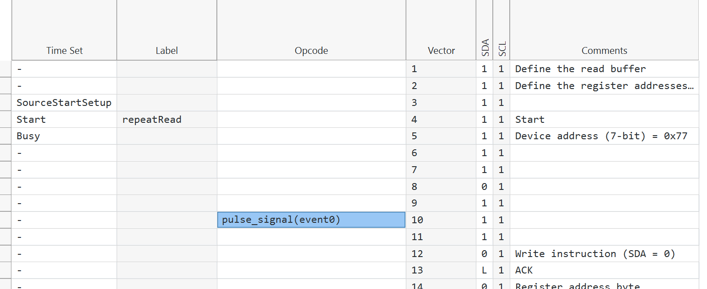

# NI DCPower Single Measurement Per Trigger Plugin (Work In Progress)
## Overview

This InstrumentStudio measurement plugin runs the NI DCPower instrument to perform single measurement when receive a trigger. It will re-arm the trigger until user stop it or the number of measurements (if specified) achieved. Initially, the DCPower instrument will source a voltage level. Then, it should start the arming of measure trigger immediately (source delay is set to zero).

(In Concept)

A table of measured results will be tabulated as string and graph plot. 

## How Does It Work
A good use case of this will be when a NI Digital Pattern Instrument send a multiple triggers in a pattern burst. User would like to measure the current of the exact vector that sends the trigger (using the opcode [`pulse_signal()`](https://www.ni.com/docs/en-US/bundle/ni-digital-pattern/page/opcodes-signal.html)). 

Due to the time between two triggers could be very small, the plugin must auto re-arm the trigger to avoid missing any trigger. It is expected the minimum time between two triggers will be the DCPower aperture time or higher. 

## Hardware Dependencies

## Software Dependencies

- InstrumentStudio Pro (2025 Q4 or higher)
- NI-DCPower (2025 Q4 or higher)
- LabVIEW (2025 Q3 or higher)

